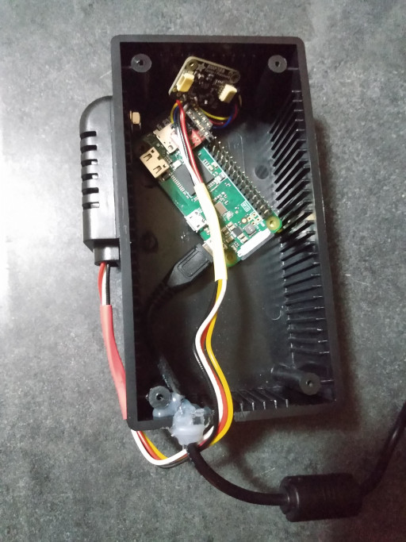
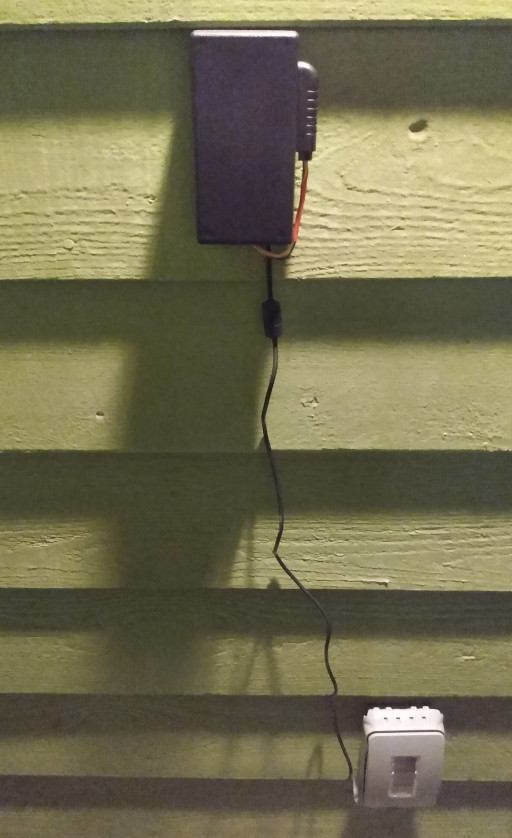

# Outdoor Temperature Monitor

Temperature Monitor using BMP388 and AM2320B sensors on a Raspberry Pi Zero WH.

<!--
SPDX-FileCopyrightText: © 2022 Stacey Adams <stacey.belle.rose@gmail.com>
SPDX-License-Identifier: MIT
-->

## Hardware Installation

### Equipment List

* [Raspberry Pi Zero WH](https://www.adafruit.com/product/3708) or [Raspberry Pi Zero W](https://www.adafruit.com/product/3400)
* [SparkFun Qwiic SHIM for Raspberry Pi](https://www.sparkfun.com/products/15794)
* [STEMMA QT / Qwiic JST SH 4-pin Cable with Premium Female Sockets](https://www.adafruit.com/product/4397)
* [Adafruit BMP388 sensor board](https://www.adafruit.com/product/3966)
* Project box: [LKG Philmore Project Box PB110 - Microcenter SKU 591057](https://www.microcenter.com/product/662080/lkg-philmore-project-box-pb110)
* microSD card: [Micro Center 16GB microSDHC Card Class 10 Flash Memory Card - Microcenter SKU 415141](https://www.microcenter.com/product/486146/micro-center-16gb-microsdhc-card-class-10-flash-memory-card-with-adapter)
* [AM2320B](https://www.jemrf.com/products/am2320b-dht22-digital-temperature-and-humidity-sensor) Temperature/Humidity Sensor, bought on eBay.

#### Power supply options

* Inland 5.25V 2.4A Wall Power Supply for Raspberry Pi: [Microcenter SKU 422766](https://www.microcenter.com/product/486582/inland-525v-24a-wall-power-supply-for-raspberry-pi-and-asus-tinker-board)
* Inland 5.2V 2.4A Micro USB Power Supply: [Microcenter SKU 279737](https://www.microcenter.com/product/637777/inland-52v-24a-micro-usb-power-supply)

### Miscellaneous Parts and Tools

* 6x2 Pin female headers (used to hold the Qwiic SHIM down)
* 2x6 or 2x20 pin male header (if using Raspberry Pi Zero W)
* [Weatherproof Electrical Outlet Cover](https://www.homedepot.com/p/304669863)
* Dremel™ rotary tool, to cut holes in project box for power and sensor wires
* Hot Glue, to seal wire outlets in project box
* Velcro Strip, to mount project box on wall
* Soldering iron, to solder the AM2320B wires to the BMP388 board

### Wiring Diagram


## Software Installation

Clone this repo to the Raspberry Pi Zero WH:

```bash
git clone https://github.com/staceybellerose/temperature-monitor.git
```

Create an [Adafruit.IO](https://io.adafruit.com/) developer account.

Copy `config.ini.sample` to `config.ini` and add your Adafruit.IO username and
key.

If you want to record your location data, there are two options:

1. Manually add your latitude and longitude to `config.ini`.

1. Create a [Positionstack](https://positionstack.com/) developer account, and
add your PositionStack.com access key to `config.ini`.

Install the necessary modules into a virtual environment:

```bash
python3 -m venv venv
venv/bin/pip3 install -r requirements.txt
```

Run the script:

```bash
venv/bin/python3 main.py
```

### Temperature Monitor Service Run at Boot

Edit `bin/temp-monitor.sh` to reflect the absolute path of this project and the
path of the python virtual environment.

Install the startup script:

```bash
sudo cp bin/temp-monitor.sh /usr/local/bin/
```

Copy the systemd unit file to the appropriate folder:

```bash
sudo mkdir -p /usr/local/lib/systemd/system/ # this folder may not exist yet
sudo cp temp-monitor.service /usr/local/lib/systemd/system/
```

Activate the service:

```bash
sudo systemctl daemon-reload
sudo systemctl enable temp-monitor.service
sudo systemctl start temp-monitor.service
```

View the output of the service to confirm that it is working:

```bash
journalctl -u temp-monitor.service -f
```

#### Still To Do

Need to make the filesystem read-only so that the microSD card doesn't corrupt
itself after running for several months.

## Images

Project box with components placed, ready to be sealed:


Closed project box, with velcro strip applied:


Project box after adding AM2320B sensor, mounted on left side with nut and bolt:



Hot glue was applied all around the nut and the AM2320B wiring before closing the project box.

Project box mounted to exterior wall:


