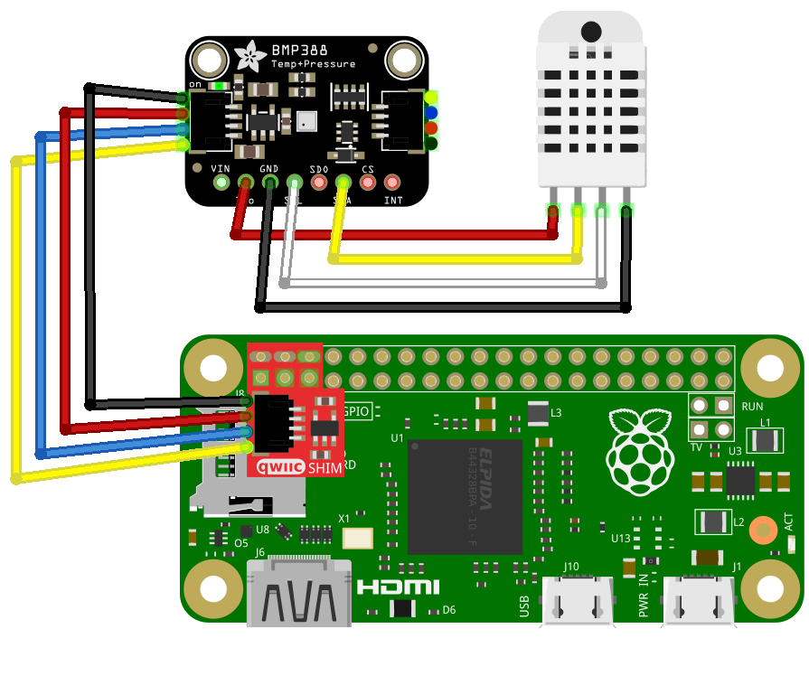

# Outdoor Temperature Monitor

Temperature Monitor using BMP388 on a Raspberry Pi Zero WH.

<!--
SPDX-FileCopyrightText: © 2022 Stacey Adams <stacey.belle.rose [AT] gmail [DOT] com>
SPDX-License-Identifier: MIT
-->

## Parts List

| Qty | Component | Part Name | Mfr Part Number |
|:---:|:-----|:-----|:----------------|
|  1  | computer | Raspberry Pi Zero WH | [Adafruit #3708](https://www.adafruit.com/product/3708) |
|  1  | sensor board | Adafruit BMP388 | [Adafruit #3966](https://www.adafruit.com/product/3966) |
|  1  | Qwiic cable | STEMMA QT / Qwiic JST SH 4-Pin Cable - 50mm Long | [Adafruit #4399](https://www.adafruit.com/product/4399) |
|  1  | Qwiic SHIM | SparkFun Qwiic SHIM for Raspberry Pi | [SparkFun DEV-15794](https://www.sparkfun.com/products/15794) |
|  1  | power supply | Inland 5.25V 2.4A Wall Power Supply for Raspberry Pi | [Microcenter SKU 422766](https://www.microcenter.com/product/486582/inland-525v-24a-wall-power-supply-for-raspberry-pi-and-asus-tinker-board) |
|  1  | power supply (alternative) | Inland 5.2V 2.4A Micro USB Power Supply | [Microcenter SKU 279737](https://www.microcenter.com/product/637777/inland-52v-24a-micro-usb-power-supply) |
|  1  | project box | LKG Philmore Project Box PB110 | [Microcenter SKU 591057](https://www.microcenter.com/product/662080/lkg-philmore-project-box-pb110) |
|  1  | microSD card | Micro Center 16GB microSDHC Card Class 10 Flash Memory Card | [Microcenter SKU 415141](https://www.microcenter.com/product/486146/micro-center-16gb-microsdhc-card-class-10-flash-memory-card-with-adapter) |

### Miscellaneous Parts

* 6x2 Pin female headers
* Weatherproof Electrical Outlet Cover
* Hot Glue
* Velcro Strips

## Wiring Diagram



## Software Installation

Clone this repo to the Raspberry Pi Zero WH:

```bash
git clone https://github.com/staceybellerose/temperature-monitor.git
```

Create a [Positionstack](https://positionstack.com/) developer account.

Create an [Adafruit.IO](https://io.adafruit.com/) developer account.

Copy `config.ini.sample` to `config.ini` and add your PositionStack.com access key,
and your Adafruit.IO username and key.

Install the necessary modules:

```bash
python3 -m venv venv
venv/bin/pip3 install -r requirements.txt
```

Run the script:

```bash
venv/bin/python3 main.py
```

## Images


